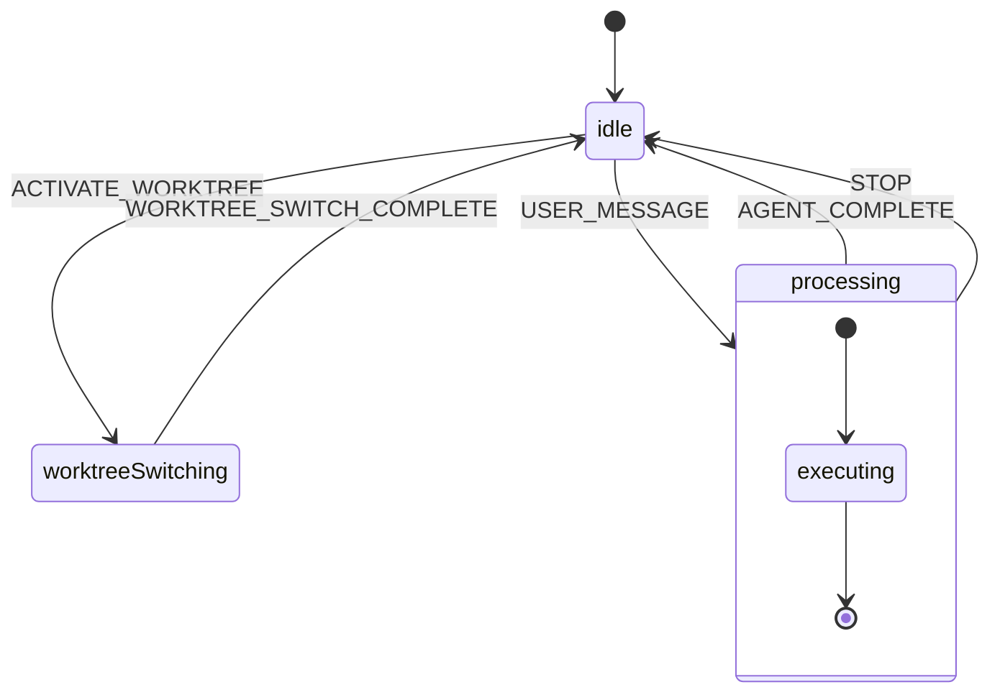

# @agent-manager/electron

`packages/electron` は、Agent Manager の「実行王国 (Execution Kingdom)」です。実際のシステム操作、プロセス管理、状態保持のすべてをここで行います。

## セッションライフサイクル (`src/application/sessions`)

エージェントセッションは、**OneShotSession** クラスによって管理されます。内部では [XState](https://stately.ai/docs/xstate) を使用したステートマシン (`agentMachine`) が動作しています。

### ステートマシン図

### 状態の説明
*   **`idle`**: ユーザーからの入力を待機している状態。設定変更やワークツリー切り替えもこの状態で受け付けます。
*   **`processing`**: エージェントが実行中の状態。
    *   サブプロセス（CLI ツール）を起動。
    *   出力をストリーミングで解析。
    *   JSON イベントを検知して状態（セッションIDなど）を更新。
*   **`worktreeSwitching`**: Git ワークツリーを切り替えている一時的な状態。

## エージェントドライバー (`src/infrastructure/agent-drivers`)

エージェントの実行は「ドライバー」パターンによって抽象化されています。`DriverResolver` が設定 (`type`) に基づいて適切なドライバーを選択します。

### サポートされているドライバー
1.  **`claude`**: Anthropic Claude エージェントを実行。
2.  **`gemini`**: Google Gemini エージェントを実行。
3.  **`codex`**: OpenAI (GPT) ベースのエージェントを実行。
4.  **`ollama`**: ローカル LLM (Ollama) を使用。
5.  **`custom`**: ユーザー定義のコマンドを実行。

### 実行メカニズム
すべてのドライバーは最終的に `child_process.spawn` を使用して外部プロセス（CLI ツール）を起動します。API キーなどの機密情報は、`EnvBuilder` によって環境変数としてプロセスに注入されます。

## インフラストラクチャサービス

### Store (`src/infrastructure/store`)
簡易的なファイルベースのデータストアです。
*   `projects.json`: プロジェクト設定。
*   `conversations.json`: チャット履歴。
*   `app-settings.json`: アプリケーション全体の設定。

### Configuration
設定は複数のレイヤーで管理されます：
1.  **`agent.config.json`**: プロジェクトルートに配置されるエージェント設定。
2.  **`.gtrconfig`**: ユーザーホームディレクトリにあるグローバル設定（APIキーなど）。
3.  **`local settings`**: GUI で設定された一時的なオーバーライド。

## 起動フロー詳細

1.  **`main.ts`**: Electron の `app.whenReady()` で起動。
2.  **`bootstrap.ts`**:
    *   `FileStore` を初期化し、ディスクからデータをロード。
    *   `UnifiedAgentManager` を初期化。
    *   `WebServerManager` を起動（空いているポートを自動探索）。
    *   `createRouter(ctx)` で API ルーターを構築。
3.  **ウィンドウ作成**: メインウィンドウを作成し、ローカル Web サーバーの URL をロード。
